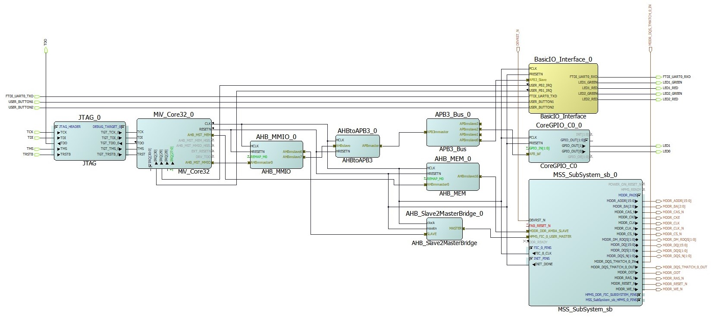

# I/O Testing on IGLOO2 FGPA Board
This is a project for IO testing on the [IGLOO2 MGL025 Creative Development FPGA Board](https://www.futureelectronics.com/p/development-tools--development-tool-hardware/futurem2gl-evb-future-electronics-dev-tools-7091559) from Future Electronics. The FPGA board suppports a RISC-V softcore and a FreeRTOS kernel. The purpose of this project is to test the IOs by running a "Hello World"  application by turning ON/OFF some LEDs. More detailed tutorials of how to use Libero SoC with this project can be found [here](https://github.com/cheevang6/RISC-V_FreeRTOS_Computer_Vision)

## 1. Installation
[Libero SoC v12.0](https://www.microsemi.com/product-directory/design-resources/1750-libero-soc#downloads) or higher design tool is required to program the board. Information to obtain a free license is located
[here](https://www.microsemi.com/product-directory/design-resources/1711-licensing). To run a software application on the board that have just been programmed with the desired hardware design, [SoftConsole IDE v6.0](https://www.microsemi.com/product-directory/design-tools/4879-softconsole#downloads) or higher is necessary.

## 2. Hardware Design
The hardware design consists of the following components:
* MSS_SubSystem
* Mi-V_Core32
* BasicIO_Interface - Future Electronics interface with UART and GPIO
    * UART
    * GPIO
* CoreGPIO
* AHB_Save2MasterBridge
* AHB_MEM
* AHBtoAPB3
* APB3_Bus

Fig. 1. Hardware design for IO testing

### 2.1 MSS SubSystem
This core is the created by the System Builder to configure and initialize the IGLOO2 FPGA. In this component, the circuitry, clock tree, AMBA bus structure, and reset circuitry can be customized to a desired system. This component will automatically initialize, configure, and connect the required low level blocks that was specified in its settings. Peripherals are then connected to the the System Builder by using a SmartDesign. In this project, 

### 2.2 Mi-V Core32
Mi-V is Microchip's RISC-V softcore processor. There are a variety of RISC-V cores provided in Libero SoC. For this project, the MIV_RV32IMA_LI_AHB is used with AHB interface for I/O and memory access. The core includes JTAG interface for debugging purposes. As the implies, RV32I variant provides 32-bit addresses spaces  and instructions with integer operations. In addition, other extensions included with this core are "M" and "A" which signify integer multiply/divide and attomic (operations that can be completed in a single step) operations, respectively. This core contains two external AHB interfaces. The first is AHB cached memory interface used by the cache controller to refill instruction and data caches starting at address 0x800000000 to 0x8FFFFFFF. The second is AHB I/O interface for non-cached access to I/O peripheral or memory  with address from 0x60000000 to 0x7FFFFFFF

### 2.3 BasicIO Interface

### 2.4 CoreGPIO

### 2.5 AHB Slave to Master Bridge

### 2.6 AHB MEM

### 2.7 AHB to APB3_Bus

### 2.8 APB3 Bus
Peripheral interconnect
contains the memory address of pheripherals where they can be modified 
From Mi-V core, the peripheral

## Software Application
There are existing firmware drivers for the IP cores in Libero SoC. The drivers can be found in the Firmware Catalog that was downloaded along with Libero SoC. Do not forget to place/include the generated drivers into the software project. For this project, a few GPIO port are used to drive some LEDs. To 

## Design for I/O Testing

## Demo

## Credits
[Here](https://github.com/Future-Electronics-Design-Center/Creative-Eval-Board/tree/master/IGL2_MiV_FreeRTOS_Demo) is the link Future Electronics demo projects that was used as a foundation for this project. 
